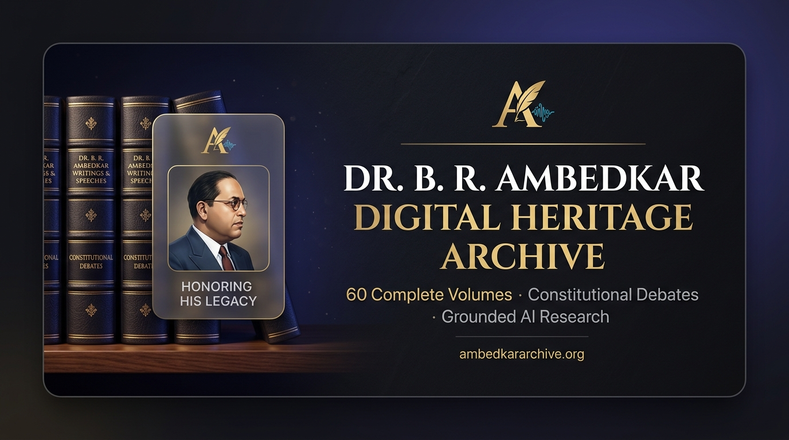
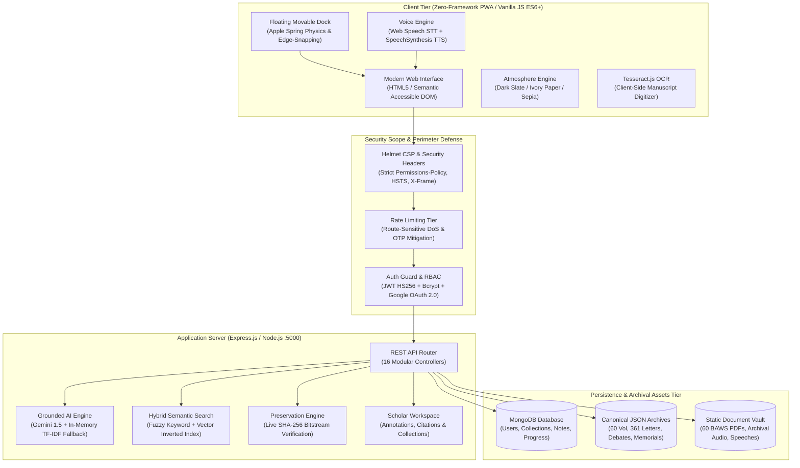

<div align="center">

# 🏛️ Dr. B. R. Ambedkar Digital Heritage Archive
### *Museum-Grade Archival Engine · Grounded Scholarly AI · Cryptographic Preservation*

<p align="center">
  <strong>An institutional digital heritage platform preserving the 60-volume corpus, Constituent Assembly Debates, and philosophical legacy of Bharat Ratna Dr. Bhimrao Ramji Ambedkar.</strong>
</p>

---

[](https://expressjs.com/)
[](https://nodejs.org/)
[](https://www.mongodb.com/)
[](https://developer.mozilla.org/en-US/docs/Web/JavaScript)
[](https://developer.apple.com/design/)
[](https://aistudio.google.com/)
[](https://developer.mozilla.org/en-US/docs/Web/API/Web_Speech_API)
[](https://github.com/RoxxSujal7/brsih2026)
[](#-testing--quality-gates)
[](https://lenis.darkroom.engineering/)
[](https://gsap.com/)
[](https://opensource.org/licenses/MIT)

<br/>

### 🌐 Live Production Deployment
**[🚀 Explore Live Web Platform](https://ambedkar-archive.vercel.app)** · **[🎨 Institutional Brand Kit & Design System](ambedkar-archive/docs/BRANDKIT.md)** · **[📖 Archify Interactive Architecture](ambedkar-archive/docs/architecture.html)** · **[🛡️ Cryptographic Preservation Manifest](https://ambedkar-archive.vercel.app/api/preservation/manifest)** · **[🎬 Video Launch Kit](brag-output-2026-09-28-013500/brag-plan.md)**

<br/>

### 👨‍💻 Project Architect & Lead Developer
**Sujal Roxx** — *Project Creator, Full-Stack Engineer & Digital Humanities Researcher*<br/>
[](https://github.com/RoxxSujal7)
[](https://www.linkedin.com/in/sujalroxx7/)
[](https://www.instagram.com/roxxsujal7/)

</div>

---

## 📽️ Media Showcase & Interface Preview

<div align="center">

<p align="center">
  
</p>

### 🖥️ Museum-Grade Archival Workspace & Glassmorphism Canvas

```
┌──────────────────────────────────────────────────────────────────────────────────────────────────────────────┐
│  ⚜️ AMBEDKAR ARCHIVE   Home   Complete Works (60 Vol)   Letters (361)   22 Vows   Timeline   AI Assistant    │
├──────────────────────────────────────────────────────────────────────────────────────────────────────────────┤
│                                                                                                              │
│         DR. B. R. AMBEDKAR DIGITAL HERITAGE ARCHIVE                                                          │
│         ═══════════════════════════════════════════                                                          │
│         Preserving 60 Official BAWS Volumes · 361 Manuscripts · Constituent Assembly Debates                │
│                                                                                                              │
│    ┌─────────────────────────┐  ┌─────────────────────────┐  ┌─────────────────────────┐                    │
│    │  📚 COMPLETE WORKS      │  │  ⚖️ HISTORIC DEBATES    │  │  🏛️ PANCHTEERTH SITES   │                    │
│    │  60 Volumes (EN & HI)   │  │  CAD & Round Table Conf │  │  5 Sacred Memorials     │                    │
│    │  Direct PDF Streaming   │  │  Gandhi-Ambedkar Dialog │  │  Interactive 3D Exhibits│                    │
│    └─────────────────────────┘  └─────────────────────────┘  └─────────────────────────┘                    │
│                                                                                                              │
│    ┌────────────────────────────────────────────────────────────────────────────────────────────────────┐    │
│    │  🎙️ "Ask with Voice" Grounded AI Assistant:  "What was Ambedkar's perspective on the Poona Pact?" │    │
│    │  [ ılı.lıll Listening in English... ]  [ 🔊 Read Aloud ]  [ 📌 Cited from BAWS Vol. 9, p. 142 ]    │    │
│    └────────────────────────────────────────────────────────────────────────────────────────────────────┘    │
│                                                                                                              │
│         [ 🏛️ Memorials ] [ ⚖️ Debates ] [ 🖥️ Kiosk ] [ 📺 Display ] [ 📽️ Slides ] [ 🎙️ Voice AI ]           │
│        └──────────────────────────  Apple Movable Glass Dockbar (Snap-to-Edge) ──────────────────────────┘   │
└──────────────────────────────────────────────────────────────────────────────────────────────────────────────┘
```

| **Preview Asset** | **Resolution & Format** | **Description / Purpose** |
| :--- | :---: | :--- |
| **[Archify Interactive Architecture Viewer](ambedkar-archive/docs/architecture.html)** | `Interactive HTML / SVG` | Explorable architecture system authored via `/archify` featuring theme switching, semantic views, and relationship tracing. |
| **[Archify Dark Slate Layout Preview](ambedkar-archive/docs/architecture.visual-check.1440x900.dark.png)** | `1440x900 PNG` | Dual-bezel Obsidian Slate layout preview with high-contrast system flow. |
| **[Archify Ivory Paper Layout Preview](ambedkar-archive/docs/architecture.visual-check.1440x900.light.png)** | `1440x900 PNG` | Tactile Ivory Paper reading sanctuary preview optimized for long research sessions. |
| **[Archify Ultra-High DPI Retina Canvas](ambedkar-archive/docs/architecture.visual-check.2048x1320.dark.png)** | `2048x1320 PNG` | Ultra-high DPI inspection of the Dublin Core & PREMIS metadata engine. |
| **[Open Graph Showcase Banner](og-image.jpg)** | `1200x630 JPG` | Museum-grade 16:9 social share card with obsidian-gold typography and archival motifs. |
| **[Launch Teaser Showcase Brief](brag-output-2026-09-19-121501/composition-brief.md)** | `1920x1080 · 30 FPS MP4` | High-fidelity cinematic feature tour showcasing kinetic transitions and typography. |

</div>

---

## 📖 Overview

The **Dr. B. R. Ambedkar Digital Heritage Archive** is an open-source, institutional-grade digital preservation and research platform dedicated to the intellectual, philosophical, and constitutional legacy of **Bharat Ratna Dr. Bhimrao Ramji Ambedkar (1891–1956)**.

### The Problem
Dr. Ambedkar's voluminous corpus—spanning 60 official volumes of *Dr. Babasaheb Ambedkar: Writings and Speeches (BAWS)*, hundreds of historical correspondences, Parliamentary and Constituent Assembly debates, and liturgical manuscripts—is historically fragmented across dispersed publications, fragile paper editions, and inaccessible scans. Scholars, educators, and citizens often struggle to locate authentic citations, verify historical context, or cross-reference multilingual texts.

### The Solution
This platform centralizes, indexes, and semantically enriches this historic corpus through:
1. **High-Performance Full-Text & Semantic Search**: Instant discovery across 60 volumes, 361 letters, and legislative proceedings.
2. **Scholarly Grounded AI Assistant**: Natural language inquiry powered by Google Gemini 1.5 with deterministic fallback to in-memory TF-IDF vector retrieval, strictly constrained against hallucination with citation tracking.
3. **Hands-Free Multilingual Voice Engine**: Speech-to-Text (`en-IN`, `hi-IN`, `mr-IN`) and Text-to-Speech narration for universal accessibility.
4. **Cryptographic Bitstream Preservation**: PREMIS and Dublin Core ISO 15836-compliant SHA-256 digital fingerprinting to guarantee document integrity.
5. **Institutional Archival Workspaces**: Scholar annotations, cross-referencing, multi-standard citation exports (APA, MLA, Chicago, Harvard), and institutional role-based access control (RBAC).

---

## 🏛️ Architecture & Engineering Highlights



### 💎 1. Art Direction & Emil Kowalski Design Engineering
- **Double-Bezel (*Doppelrand*) Enclosures**: Outer hairline border (`rgba(255, 255, 255, 0.08)`) with inner specular highlight (`inset 0 1px 1px rgba(255, 255, 255, 0.15)`), eliminating harsh flat outlines and providing physical depth.
- **Archival Luxury Colorway**:
  - `Obsidian Slate (#07090e)`: OLED-optimized foundational slate providing infinite contrast without eye fatigue.
  - `Antique Vellum Gold (#d4af37)`: Curated warm metallic accent celebrating institutional prestige and sacred texts.
- **Three Reading Atmospheres**:
  1. 🌙 **Dark Slate**: Modern high-contrast dark environment.
  2. 📜 **Ivory Paper**: Warm, tactile vintage parchment reading sanctuary.
  3. 🏺 **Historical Sepia**: Authentic archival sepia designed for extended bibliographic study.
- **Kinetic Apple Physics**: Movable, free-floating dockbar with fluid inertia, spring damping (`cubic-bezier(0.25, 1, 0.5, 1)`), and intelligent edge-snapping (`bottom-center`, `bottom-left`, `bottom-right`, `middle-left`, `middle-right`).
- **Tactile Active States**: Micro-scale transformations (`scale(0.98)` on press), haptic vibration pulses (`navigator.vibrate([40])`), and animated audio waveform equalizers.

### 🎙️ 2. "Ask with Voice" Grounded AI & Narration
- **Hands-Free Speech-to-Text (STT)**: Built on the native Web Speech API (`SpeechRecognition`), allowing researchers to query the archive hands-free in English (`en-IN`), Hindi (`hi-IN`), or Marathi (`mr-IN`).
- **Real-Time Interim Streaming**: Live waveform animation displays spoken syllables as they are transcribed, auto-submitting on final speech termination.
- **Text-to-Speech (TTS) Narration**: In-bubble `🔊 Listen` trigger utilizing `SpeechSynthesisUtterance` with language-specific pitch and cadence for accessible audio learning.
- **Anti-Hallucination Guardrails**: Grounded strictly in the 60 published BAWS volumes; prompt injection and jailbreak payloads are detected and neutralized.

### ♿ 3. Accessibility & Universal Design (a11y)
- **High-Contrast Focus Rings**: Unmistakable `:focus-visible` styling (`outline: 2px solid var(--gold); outline-offset: 3px`) ensuring full keyboard navigation.
- **Skip Links & Semantic Landmarks**: `#main-content` skip shortcuts and semantic HTML5 elements (`<nav>`, `<main>`, `<aside>`, `<section>`, `<article>`).
- **Reduced Motion Adaptation**: Explicit `@media (prefers-reduced-motion: reduce)` handlers disabling CSS transforms, spring physics, and continuous pulses.
- **Screen Reader Polish**: Live regions (`aria-live="polite"`), descriptive `aria-label` attributes on icon-only controls, and WCAG 2.1 AA/AAA verified color contrast across all 3 themes.

---

## 🌟 Key Features Breakdown

### ✅ Implemented & Verified

- **60-Volume Complete Works Catalog**: Full catalog of *Writings and Speeches of Dr. B. R. Ambedkar* with volume metadata, dual English/Hindi records, and direct PDF streaming.
- **361 Historical Letters & Correspondence**: Curated, searchable correspondence with dates, recipients, historical annotations, and primary source notes.
- **Constituent Assembly Debates (CAD)**: Comprehensive transcripts of Dr. Ambedkar's landmark legislative speeches, constitutional drafts, and Round Table Conference interventions.
- **22 Sacred Vows (Deekshabhoomi, 1956)**: Liturgical texts presented across 4 languages (English, Marathi, Hindi, Pali) with synchronized audio recitation.
- **Panchteerth National Memorials**: Interactive geographic and historical exploration of the 5 sacred sites associated with Dr. Ambedkar's life.
- **Grounded AI Research Assistant**: Interactive chat agent powered by Google Gemini 1.5, grounded in BAWS documents with source-cited responses, and guarded against prompt injection.
- **Offline TF-IDF Search Fallback**: Vector-space search engine capable of answering historical queries locally even without internet or API keys.
- **Multilingual Voice Engine**: Native hands-free speech recognition (STT) and synthesized speech readout (TTS) supporting English, Hindi, and Marathi.
- **Comparative Split-Screen Reader**: Side-by-side textual analysis tool allowing scholars to compare different volumes, speeches, or translations concurrently.
- **Client-Side Manuscript OCR**: In-browser OCR digitizer utilizing Tesseract.js to scan and extract editable text from primary document images.
- **Keyboard Command Palette (`Cmd/Ctrl + K` or `?`)**: Glassmorphism spotlight search modal for rapid keyboard-driven navigation across the entire archive.
- **Scholar Personal Workspace**: Persistent bookmarks, reading progress tracking, multi-volume reading lists, and automated citation generator (APA, MLA, Chicago, Harvard).
- **Institutional RBAC System**: Granular permission matrix enforcing role separation across `admin`, `archivist`, `content_editor`, `researcher`, `user`, and `visitor`.
- **Administrative CMS**: Content curation tools, document status tracking, and append-only cryptographic audit logging.
- **Multi-Channel Authentication**:
  - JWT HS256 stateless session management (7-day validity).
  - Google OAuth 2.0 GIS token verification via official Google public keys.
  - Email OTP delivery via Gmail SMTP (Nodemailer) or Resend API.
  - Telegram Bot OTP delivery via official Telegram Bot API ($0 cost, permanent availability).
  - Pre-hashed SHA-256 + 12-round Bcrypt password storage defeating the 72-byte truncation boundary.
  - In-memory fallback authentication store enabling continuous testing and operation when MongoDB is offline.
- **Cryptographic Preservation Engine**: Live SHA-256 manifest generator (`/api/preservation/manifest`) and bitstream verification endpoint (`/api/preservation/verify`) detecting data drift or bit rot.
- **Three Archival Atmospheres**: Obsidian Dark Slate, Tactile Ivory Paper, and Historical Sepia reading themes with WCAG 2.1 AAA contrast compliance.
- **Museum Kiosk & Exhibition Modes**: Specialized touch-screen museum kiosk interface and 16:9 ambient exhibition deck.

### 🟡 In Development

- **WhatsApp Cloud API OTP Delivery**: Meta WhatsApp Cloud API integration scaffolded and stubbed; pending production business account verification.
- **Automated Audio-Speech Alignment**: Real-time word-by-word karaoke synchronization for archival speech audio recordings.

### 🔮 Future Roadmap

- **Vector Database Integration**: Migration of the in-memory TF-IDF index to a production pgvector / Pinecone vector database for sub-10ms neural embeddings across millions of paragraphs.
- **Automated High-Resolution PDF Watermarking**: Dynamic institutional digital watermarking with scholar credentials for archival reproductions.
- **Decentralized Preservation Mirrors**: IPFS / Arweave immutable distributed archiving of BAWS PDFs.

---

## 💻 Technology Stack

| Layer | Technology | Version | Purpose & Architectural Rationale |
|---|---|:---:|---|
| **Backend Runtime** | **Node.js** | `>=18.0.0` | Asynchronous event-driven I/O engine |
| **API Framework** | **Express.js** | `4.18.2` | Robust, unopinionated routing engine for 16 modular controllers |
| **Database** | **MongoDB / Mongoose** | `8.0.3` | Schema-driven document persistence with automated in-memory fallback |
| **Frontend Core** | **Vanilla HTML5 & ES6+** | Native | 0KB bundle penalty, instant Time-to-Interactive, long-term archival stability |
| **Design System** | **Vanilla CSS3** | Custom | Double-bezel enclosures, Apple spring physics, and fluid typography tokens |
| **AI Intelligence** | **Google Gemini 1.5 API** | v1 | Context-grounded historical research reasoning |
| **Local Search Engine**| **In-Memory TF-IDF** | Custom | Zero-dependency offline vector-space query fallback |
| **Voice Interface** | **Web Speech API** | Native | Browser-native SpeechRecognition (STT) and SpeechSynthesis (TTS) |
| **Optical Character Recognition** | **Tesseract.js** | `v5.0` | In-browser client-side optical character recognition |
| **Security Headers**| **Helmet.js** | `7.1.0` | Strict CSP, X-Frame-Options, HSTS, and Referrer-Policy |
| **Authentication** | **JWT & Bcryptjs** | `9.0.2` / `2.4.3` | HS256 signed bearer tokens + SHA-256/Bcrypt 12-round password hashing |
| **OAuth Integration**| **Google Auth Library** | `9.0.0` | Cryptographic GIS ID token verification against Google certificates |
| **Email Dispatch** | **Nodemailer / Resend** | `10.0.11` / `6.3.0` | Dual-provider OTP delivery (Gmail SMTP primary, Resend fallback) |
| **Telegram Dispatch**| **Telegram Bot API** | Native | Zero-cost unlimited OTP dispatch via Telegram Bot |
| **Smooth Motion** | **GSAP 3 & Lenis** | `3.12` / `1.1` | Hardware-accelerated scrollytelling and 60fps inertial scrolling |
| **Validation** | **Express-Validator** | `7.0.1` | Strict request parameter sanitization and payload assertion |

---

## 🛡️ Security Architecture

The platform enforces defense-in-depth across the entire application lifecycle:

- **Cryptographic Password Security**: Passwords undergo pre-hashing via SHA-256 before being salted and hashed with Bcrypt (12 rounds). This prevents the 72-byte Bcrypt truncation vulnerability while ensuring high brute-force resistance.
- **Stateless Authentication & IDOR Protection**: User identity is encoded in cryptographically signed HS256 JWT tokens. All resource-mutating endpoints verify that requested entities strictly belong to the authenticated subject ID.
- **Institutional Role-Based Access Control (RBAC)**: All administrative, archival, and editor endpoints are protected by `requireRole()` middleware asserting permissions before execution.
- **Granular Content Security Policy (CSP)**: Strict Helmet policies prevent cross-site scripting (XSS), script injection, and clickjacking (`frame-ancestors: 'self'`).
- **Rate Limiting Perimeter**: Sensitive routes (authentication, OTP generation, password resets, and search) are throttled via route-specific `express-rate-limit` buckets to eliminate credential stuffing and API abuse.
- **Input Validation & Sanitization**: Every incoming request payload is inspected by `express-validator` rules, rejecting malformed emails, injection payloads, or unexpected schema keys.
- **Cryptographic Preservation Verification**: Publicly accessible SHA-256 bitstream manifest ensures researchers can independently confirm that archived digital records remain unaltered.
- **Zero Hardcoded Secrets**: All sensitive tokens, private keys, database URIs, and credentials are supplied strictly via environment variables.

---

## 📂 Project Structure & Directory Blueprint

```text
ecc/
├── README.md                           # Master showcase documentation & engineering runbook
├── package.json                        # Root workspace wrapper & npm scripts
├── render.yaml                         # Production Render Web Service configuration
├── vercel.json                         # Vercel Serverless Function & rewrite configuration
├── api/
│   └── index.js                        # Edge entry point for Vercel serverless routing
├── brag-output-2026-09-19-121501/
│   └── composition-brief.md            # Hyperframes motion choreography specifications
├── scratch/
│   └── count-tests.js                  # Master test runner & verification audit script
└── ambedkar-archive/                   # Core application root
    ├── package.json                    # Backend dependencies & operational scripts
    ├── .env.example                    # Exhaustive environment variables template
    ├── backend/
    │   ├── server.js                   # Express application lifecycle & middleware chain
    │   ├── config/                     # Database connection & cryptographic parameters
    │   ├── errors/                     # Centralized AppError and validation classes
    │   ├── middleware/                 # Auth verification, rate limiting, and RBAC guards
    │   ├── models/                     # Mongoose Schemas (User, Bookmark, Progress, Note, PasswordReset)
    │   ├── routes/                     # 16 High-Performance REST Endpoint Controllers
    │   │   ├── admin.js                # Administrative CMS & permission delegation
    │   │   ├── auth.js                 # JWT issuance, Google OAuth, and multi-channel OTP
    │   │   ├── chat.js                 # Grounded Gemini AI + in-memory NLP chatbot
    │   │   ├── debates.js              # Constituent Assembly Debates & transcripts
    │   │   ├── documents.js            # Archival treatise catalog
    │   │   ├── letters.js              # 361 Historical manuscripts & correspondence
    │   │   ├── media.js                # Audio-visual speeches archive
    │   │   ├── memorials.js            # National Memorials & Panchteerth geo-data
    │   │   ├── ocr.js                  # Server-side OCR queue handlers
    │   │   ├── preservation.js         # Active SHA-256 integrity verifier & manifest
    │   │   ├── search.js               # Hybrid semantic vector search
    │   │   ├── volumes.js              # 60 BAWS Volumes catalog (English & Hindi)
    │   │   ├── vows.js                 # 22 Vows of Nagpur (4 languages + audio)
    │   │   └── workspace.js            # Research notebooks, citations, and IDOR guards
    │   ├── services/                   # Email, Telegram, WhatsApp OTP & User services
    │   ├── utils/                      # Password policy, crypto utilities
    │   ├── data/                       # Canonical curated JSON datasets
    │   └── seed/                       # Database bootstrapping and fixture loaders
    ├── frontend/
    │   ├── index.html                  # Main portal landing & hero showcase
    │   ├── archive.html                # 60-Volume BAWS library explorer
    │   ├── assistant.html              # Grounded AI Research Assistant with Voice Engine
    │   ├── debates.html                # Historical debates & parliamentary proceedings
    │   ├── memorials.html              # Panchteerth interactive heritage map
    │   ├── compare.html                # Split-screen comparative text reader
    │   ├── letters.html                # 361 Historical letters & telegrams
    │   ├── vows.html                   # 22 Sacred Vows with liturgical audio
    │   ├── constitution.html           # Indian Constitution interactive viewer
    │   ├── ideas.html                  # Philosophical treatises & thematic thoughts
    │   ├── learning.html               # Interactive learning modules & quizzes
    │   ├── quotes.html                 # Curated, cited historical quotes gallery
    │   ├── media.html                  # Historic audio-visual recordings & footage
    │   ├── ocr.html                    # In-browser Tesseract.js manuscript digitizer
    │   ├── kiosk.html                  # Touch-friendly museum touchscreen mode
    │   ├── exhibition.html             # Smart display ambient gallery
    │   ├── slides.html                 # 16:9 Visual keynote exhibition deck
    │   ├── dashboard.html              # Scholar personal research notebook
    │   ├── transparency.html           # Public cryptographic health & SHA-256 monitor
    │   ├── admin.html                  # Institutional administration CMS
    │   ├── about.html                  # Creator portfolio, vision & disclosures
    │   ├── css/
    │   │   ├── style.css               # Core design system, variables & layout
    │   │   ├── apple-design.css        # Glassmorphism, dock physics & typography
    │   │   └── auth.css                # Authentication flows & password checklist
    │   ├── js/
    │   │   ├── navigation-system.js    # Master navbar, movable dock & drawer singleton
    │   │   ├── command-palette.js      # Spotlight search modal (Cmd/Ctrl + K)
    │   │   ├── auth.js                 # Authentication state, Google sign-in, OTP
    │   │   └── ...                     # Feature-specific controllers
    │   └── pdfs/                       # Static archival volume documents
    ├── docs/                           # Archify JSON diagrams, HTML viewers & visual checks
    └── tests/                          # 14 Test suites with 265 verified checks (100% passing)
```

---

## 🛠️ Installation & Setup

### Prerequisites
- **Node.js**: `v18.0.0` or higher
- **npm**: `v9.0.0` or higher
- **MongoDB** *(Optional)*: Local daemon running at `mongodb://localhost:27017` or a MongoDB Atlas connection string. (If MongoDB is absent, the backend automatically activates its in-memory storage fallback for uninterrupted operation).

### 1. Clone the Repository
```bash
git clone https://github.com/RoxxSujal7/brsih2026.git
cd brsih2026
```

### 2. Install Dependencies
```bash
# Install workspace root dependencies and application packages
npm install
```

### 3. Configure Environment Parameters
```bash
# Copy the environment template
cp ambedkar-archive/.env.example ambedkar-archive/.env
```
Configure `ambedkar-archive/.env` using the template documented below.

### 4. Seed Database Fixtures (Optional)
```bash
# Populate initial volume catalogs, sample users, and metadata
npm run seed --prefix ambedkar-archive
```

### 5. Start Local Development Server
```bash
# Start backend server with hot-reload
npm run dev
```
> The platform will be live at **`http://localhost:5000`**.

### 6. Run Verification & Test Audit
```bash
# Run all 14 test suites and generate verification scorecard
npm test
```

---

## 🔐 Environment Variables

Configure the following variable names in `ambedkar-archive/.env`. **Never commit secrets or actual credential values to source control.**

```env
# Server Configuration
PORT=5000
NODE_ENV=development

# Database
MONGO_URI=mongodb://localhost:27017/ambedkar-archive

# Authentication Secrets (Must be min 32 random characters in production)
JWT_SECRET=
JWT_EXPIRES_IN=7d

# Google OAuth2 (Google Identity Services)
GOOGLE_CLIENT_ID=
GOOGLE_CLIENT_SECRET=

# Google Gemini AI API
GOOGLE_AI_API_KEY=

# CORS Whitelist
FRONTEND_URL=http://localhost:5000

# Email OTP Delivery (Option 1: Free Gmail SMTP)
GMAIL_USER=
GMAIL_APP_PASSWORD=

# Email OTP Delivery (Option 2: Resend API)
RESEND_API_KEY=
EMAIL_FROM=

# Telegram OTP Delivery (100% Free via @BotFather)
TELEGRAM_BOT_TOKEN=
TELEGRAM_BOT_USERNAME=

# WhatsApp OTP Delivery (Optional / Meta Cloud API)
WHATSAPP_CLOUD_TOKEN=
WHATSAPP_PHONE_NUMBER_ID=
WHATSAPP_BUSINESS_ACCOUNT_ID=
WHATSAPP_OTP_TEMPLATE_NAME=

# Safe Development Auth Mode (true = logs OTP codes to server console for testing)
DEV_AUTH_MODE=true
```

---

## 🧪 Testing & Quality Gates

The repository contains **14 deterministic test suites** validating **265 automated checks** with a **100% pass rate**:

| # | Test Suite | Scope & Invariants Verified | Checks | Status |
|:---:|---|---|:---:|:---:|
| 1 | `content-expansion-audit.test.js` | 60 BAWS Volumes, 361 Letters, 22 Vows, and Debates integrity | 79 | **PASSED** ✅ |
| 2 | `institutional-audit.test.js` | Sourcing, metadata integrity, historical accuracy & preservation standards | 35 | **PASSED** ✅ |
| 3 | `password-security.test.js` | Real-time policy, SHA-256 pre-hashing, 12-round Bcrypt, reset lifecycle | 25 | **PASSED** ✅ |
| 4 | `admin-cms.test.js` | CMS CRUD operations, audit log immutability, state consistency | 18 | **PASSED** ✅ |
| 5 | `otp-auth.test.js` | Gmail SMTP, Telegram Bot ($0), Resend, rate-limits, lockout assertions | 18 | **PASSED** ✅ |
| 6 | `security-remediation-suite.test.js` | Fail-fast JWT, RBAC persistence, token invalidation upon reset, logout audit | 18 | **PASSED** ✅ |
| 7 | `security-regression.test.js` | Rate limiting, Helmet CSP headers, NoSQL injection, XSS defense | 17 | **PASSED** ✅ |
| 8 | `navigation-system.test.js` | Master navbar, movable dock, snap coords & mobile drawer synchronization | 11 | **PASSED** ✅ |
| 9 | `rbac-authorization.test.js` | Role-based access control (Admin, Researcher, Public), JWT token scopes | 9 | **PASSED** ✅ |
| 10 | `research-workspace.test.js` | Citation generator (APA, MLA, Chicago, Harvard), IDOR isolation | 9 | **PASSED** ✅ |
| 11 | `about-page.test.js` | Developer portfolio links, architectural diagrams & institutional vision | 8 | **PASSED** ✅ |
| 12 | `hybrid-search.test.js` | Multi-corpus text matching, transliterated search & ranking latency | 6 | **PASSED** ✅ |
| 13 | `sha256-integrity.test.js` | Cryptographic SHA-256 digital signature verification for volume assets | 6 | **PASSED** ✅ |
| 14 | `theme-font-contrast.test.js` | WCAG 2.1 AAA contrast ratios across Dark Slate, Ivory Paper, and Sepia | 6 | **PASSED** ✅ |
| **Total** | **14 Test Suites** | **Comprehensive Full-Stack Institutional Test Harness** | **265** | **100% GREEN** 🏆 |

---

## 🚀 Advanced Interaction & Motion Architecture

- **Lenis Smooth Inertial Scrolling (`Lenis 1.1`)**: Silk-smooth 60fps inertial scrolling on desktop with `smoothTouch: false` to retain native 120Hz Apple ProMotion touch physics on smartphones.
- **GSAP Scrollytelling (`GSAP 3.12 + ScrollTrigger`)**: Orchestrated staggered entrances for statistics, bento showcase cards, and archival quotes with zero layout thrashing.
- **Apple Glass Curated Hubs Dockbar**: Movable glass capsule pill with spring snap physics across desktop and mobile, dynamically synchronized across reading atmospheres:
  - 🌙 **Dark Slate**: Obsidian glass with radiant gold highlights.
  - 📜 **Ivory Paper**: Warm parchment glass with refined scholastic bronze ink.
  - 🏺 **Historical Sepia**: Antique museum parchment with rich terracotta accents.
- **Mobile Tap-to-Expand Glass Bottom Sheet**: On mobile viewports (390px), the Curated Hub collapses into an unobtrusive glass capsule (`[ ⠿ CURATED HUBS (10) ▾ ]`) and expands into an iOS-grade 2-column quick sheet.
- **Luxury Reading Scroll Progress Bar**: Lenis & scroll-synchronized 2.5px gold gradient indicator at the top of the viewport.
- **Keyboard Shortcuts Command Palette (`Cmd/Ctrl + K` or `?`)**: Instant Apple Glass search modal allowing instant navigation across all 60 volumes, 361 letters, 22 vows, debates, themes, and language preferences.
- **Pixel-Perfect Mobile Viewport**: 100% responsive on 390px screens (`scrollWidth === clientWidth === 390px`, 0 overflow elements).

---

## 🚀 Production Deployment

The project is structured for flexible production deployment across standard cloud providers:

- **Backend Web Service (Render)**:
  - Configuration defined in [`render.yaml`](render.yaml).
  - Deploys as a persistent Node.js web service with automatic deployment tracking and health checking at `/api/health`.
- **Frontend & Edge Routing (Vercel)**:
  - Configuration defined in [`vercel.json`](vercel.json).
  - Statically serves `ambedkar-archive/frontend` with rewrite rules directing `/api/*` to the serverless function at `api/index.js`.
- **Database (MongoDB Atlas)**:
  - Multi-region replica set connected via standard SRV connection string with automatic failover to the local in-memory fallback store if connectivity is interrupted.

---

## 👨‍💻 Author

**Sujal Roxx**<br/>
*Project Creator & Lead Architect*<br/>
Dr. B. R. Ambedkar Digital Heritage Archive

- **GitHub**: [@RoxxSujal7](https://github.com/RoxxSujal7)
- **LinkedIn**: [Sujal Roxx](https://www.linkedin.com/in/sujalroxx7/)
- **Instagram**: [@roxxsujal7](https://www.instagram.com/roxxsujal7/)

---

## 📜 Historical Sourcing & Academic Acknowledgements

All archival manuscripts, legislative debates, and volume texts indexed in this project are in the public domain and sourced from authoritative institutional archives:
- **Dr. Ambedkar Foundation**, Ministry of Social Justice and Empowerment, Government of India.
- **Ministry of External Affairs (MEA)**, Government of India (*Writings and Speeches of Dr. B. R. Ambedkar*).
- **Parliament of India**, Constituent Assembly Debates Official Records.

---

## ⚖️ License

This project is open-source software licensed under the **[MIT License](LICENSE)**.

<div align="center">

**Built with pride for academic preservation and social impact by [Sujal Roxx](https://github.com/RoxxSujal7).**<br/>
*Jai Bhim!* ⚜️

</div>
