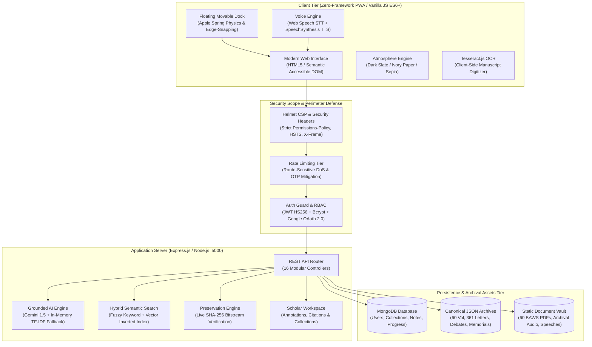

<div align="center">

# 🏛️ Dr. B. R. Ambedkar Digital Heritage Archive
### *Museum-Grade Archival Engine · Grounded Scholarly AI · Cryptographic Preservation*

<p align="center">
  <strong>An institutional digital heritage platform preserving the 60-volume corpus, Constituent Assembly Debates, and philosophical legacy of Bharat Ratna Dr. Bhimrao Ramji Ambedkar.</strong>
</p>

---

<!-- BADGES: Shields.io for-the-badge -->
[](https://expressjs.com/)
[](https://nodejs.org/)
[](https://www.mongodb.com/)
[](https://developer.mozilla.org/en-US/docs/Web/JavaScript)
[](https://developer.apple.com/design/)
[](https://aistudio.google.com/)
[](https://developer.mozilla.org/en-US/docs/Web/API/Web_Speech_API)
[](https://github.com/RoxxSujal7/brsih2026)
[](#-testing--quality-gates)
[](https://opensource.org/licenses/MIT)

<br/>

### 🌐 Live Production Deployment
**[🚀 Explore Live Web Platform](https://ambedkar-digital-archive.onrender.com)** · **[📖 Architecture Documentation](ambedkar-archive/docs/architecture.html)** · **[🛡️ Cryptographic Preservation Manifest](https://ambedkar-digital-archive.onrender.com/api/preservation/manifest)**

<br/>

### 👨‍💻 Project Architect & Lead Developer
**Sujal Pawar** — *BTech Student, Full-Stack Engineer & Digital Humanities Researcher*  
[](https://github.com/RoxxSujal7)
[](https://www.linkedin.com/in/sujalroxx7/)
[](https://www.instagram.com/roxxsujal7/)

</div>

---

## 📽️ Media Showcase & Interface Preview

<div align="center">

<p align="center">
  
</p>

### 🖥️ Museum-Grade Archival Workspace & Glassmorphism Canvas

```
┌──────────────────────────────────────────────────────────────────────────────────────────────────────────────┐
│  ⚜️ AMBEDKAR ARCHIVE   Home   Complete Works (60 Vol)   Letters (361)   22 Vows   Timeline   AI Assistant    │
├──────────────────────────────────────────────────────────────────────────────────────────────────────────────┤
│                                                                                                              │
│         DR. B. R. AMBEDKAR DIGITAL HERITAGE ARCHIVE                                                          │
│         ═══════════════════════════════════════════                                                          │
│         Preserving 60 Official BAWS Volumes · 361 Manuscripts · Constituent Assembly Debates                │
│                                                                                                              │
│    ┌─────────────────────────┐  ┌─────────────────────────┐  ┌─────────────────────────┐                    │
│    │  📚 COMPLETE WORKS      │  │  ⚖️ HISTORIC DEBATES    │  │  🏛️ PANCHTEERTH SITES   │                    │
│    │  60 Volumes (EN & HI)   │  │  CAD & Round Table Conf │  │  5 Sacred Memorials     │                    │
│    │  Direct PDF Streaming   │  │  Gandhi-Ambedkar Dialog │  │  Interactive 3D Exhibits│                    │
│    └─────────────────────────┘  └─────────────────────────┘  └─────────────────────────┘                    │
│                                                                                                              │
│    ┌────────────────────────────────────────────────────────────────────────────────────────────────────┐    │
│    │  🎙️ "Ask with Voice" Grounded AI Assistant:  "What was Ambedkar's perspective on the Poona Pact?" │    │
│    │  [ ılı.lıll Listening in English... ]  [ 🔊 Read Aloud ]  [ 📌 Cited from BAWS Vol. 9, p. 142 ]    │    │
│    └────────────────────────────────────────────────────────────────────────────────────────────────────┘    │
│                                                                                                              │
│         [ 🏛️ Memorials ] [ ⚖️ Debates ] [ 🖥️ Kiosk ] [ 📺 Display ] [ 📽️ Slides ] [ 🎙️ Voice AI ]           │
│        └──────────────────────────  Apple Movable Glass Dockbar (Snap-to-Edge) ──────────────────────────┘   │
└──────────────────────────────────────────────────────────────────────────────────────────────────────────────┘
```

| **Preview Asset** | **Resolution & Format** | **Description / Purpose** |
| :--- | :---: | :--- |
| **[Launch Teaser Showcase](brag-output-2026-09-19-121501/composition-brief.md)** | `1920x1080 · 30 FPS MP4` | High-fidelity App Store-style cinematic feature tour showcasing kinetic transitions and typography. |
| **[Architecture Dark Theme](ambedkar-archive/docs/architecture.visual-check.1440x900.dark.png)** | `1440x900 PNG` | Dual-bezel Obsidian Slate layout preview with high-contrast system flow. |
| **[Architecture Paper Theme](ambedkar-archive/docs/architecture.visual-check.1440x900.light.png)** | `1440x900 PNG` | Tactile Ivory Paper reading sanctuary preview optimized for long research sessions. |
| **[High-Res Retina Canvas](ambedkar-archive/docs/architecture.visual-check.2048x1320.dark.png)** | `2048x1320 PNG` | Ultra-high DPI inspection of the Dublin Core & PREMIS metadata engine. |
| **[Open Graph Social Banner](og-image.jpg)** | `1200x630 JPG` | Museum-grade 16:9 social share card with obsidian-gold typography and archival motifs. |

</div>

---

## 🏛️ Architecture & Engineering Highlights



### 💎 1. Art Direction & Emil Kowalski Design Engineering
- **Double-Bezel (*Doppelrand*) Enclosures**: Outer hairline border (`rgba(255, 255, 255, 0.08)`) with inner specular highlight (`inset 0 1px 1px rgba(255, 255, 255, 0.15)`), eliminating harsh flat outlines and providing physical depth.
- **Archival Luxury Colorway**:
  - `Obsidian Slate (#07090e)`: OLED-optimized foundational slate providing infinite contrast without eye fatigue.
  - `Antique Vellum Gold (#d4af37)`: Curated warm metallic accent celebrating institutional prestige and sacred texts.
- **Three Reading Atmospheres**:
  1. 🌙 **Dark Slate**: Modern high-contrast dark environment.
  2. 📜 **Ivory Paper**: Warm, tactile vintage parchment reading sanctuary.
  3. 🏺 **Historical Sepia**: Authentic archival sepia designed for extended bibliographic study.
- **Kinetic Apple Physics**: Movable, free-floating dockbar with fluid inertia, spring damping (`cubic-bezier(0.25, 1, 0.5, 1)`), and intelligent edge-snapping (`bottom-center`, `bottom-left`, `bottom-right`, `middle-left`, `middle-right`).
- **Tactile Active States**: Micro-scale transformations (`scale(0.98)` on press), haptic vibration pulses (`navigator.vibrate([40])`), and animated audio waveform equalizers.

### 🎙️ 2. "Ask with Voice" Grounded AI & Narration
- **Hands-Free Speech-to-Text (STT)**: Built on the native Web Speech API (`SpeechRecognition`), allowing researchers to query the archive hands-free in English (`en-IN`), Hindi (`hi-IN`), or Marathi (`mr-IN`).
- **Real-Time Interim Streaming**: Live waveform animation displays spoken syllables as they are transcribed, auto-submitting on final speech termination.
- **Text-to-Speech (TTS) Narration**: In-bubble `🔊 Listen` trigger utilizing `SpeechSynthesisUtterance` with language-specific pitch and cadence for accessible audio learning.
- **Anti-Hallucination & Anti-Injection Guardrails**: Grounded strictly in the 60 published BAWS volumes; prompt injection and jailbreak payloads are detected and neutralized.

### ♿ 3. Accessibility & Universal Design (a11y)
- **High-Contrast Focus Rings**: Unmistakable `:focus-visible` styling (`outline: 2px solid var(--gold); outline-offset: 3px`) ensuring full keyboard navigation.
- **Skip Links & Semantic Landmarks**: `#main-content` skip shortcuts and semantic HTML5 elements (`<nav>`, `<main>`, `<aside>`, `<section>`, `<article>`).
- **Reduced Motion Adaptation**: Explicit `@media (prefers-reduced-motion: reduce)` handlers disabling CSS transforms, spring physics, and continuous pulses.
- **Screen Reader Polish**: Live regions (`aria-live="polite"`), descriptive `aria-label` attributes on icon-only controls, and WCAG 2.1 AA/AAA verified color contrast across all 3 themes.

### 🛡️ 4. Security Gates, Cryptographic Integrity & CI/CD
- **Strix AI Autonomous Penetesting**: CI/CD pipeline integrated with Strix Autonomous Pen-Tester generating automated SARIF vulnerability reports in GitHub Actions (`.github/workflows/strix.yml`).
- **Cryptographic Bitstream Verification**: Real-time SHA-256 integrity verifier (`/api/preservation/manifest` & `/api/preservation/verify`) scanning canonical JSON archives to detect single-byte corruption, bit-rot, or tampering.
- **Defense-in-Depth Architecture**:
  - Restrictive Content Security Policy (`script-src`, `connect-src`, `frame-ancestors: 'self'`).
  - Tiered Rate Limiters defending against brute-force credential stuffing and OTP exhaustion.
  - Granular RBAC enforcing absolute privilege barriers between Public, Researcher, and Administrator scopes.
  - Zero IDOR vulnerability: All annotations, bookmarks, and collections authenticate against verified JWT subject claims.

---

## 📊 Comprehensive Tech Stack

| Layer | Technology | Version | Purpose / Architecture Rationale |
| :--- | :--- | :---: | :--- |
| **Runtime & Backend** | **Node.js** | `>=18.0.0` | High-performance asynchronous non-blocking I/O event loop |
| **API Framework** | **Express.js** | `4.18.2` | Minimal, unopinionated routing engine for 16 modular micro-services |
| **Database** | **MongoDB / Mongoose** | `8.0.3` | Scalable BSON document store for users, bookmarks, progress, and collections |
| **Frontend Core** | **Vanilla HTML5 & ES6+** | Native | Zero client build overhead, instant Time-to-Interactive, long-term stability |
| **Styling & Tokens** | **Vanilla CSS & Apple Tokens** | CSS3 | Fluid variables, glassmorphic filters, and sub-pixel double-bezel enclosures |
| **AI Intelligence** | **Google Gemini 1.5 API** | v1 | Conversational reasoning grounded strictly in historical BAWS records |
| **Semantic NLP Fallback**| **In-Memory TF-IDF** | Custom | Vector space engine ensuring 100% offline query answering without API keys |
| **Voice Engine** | **Web Speech API** | Native | Multi-language Speech-to-Text (`SpeechRecognition`) & Text-to-Speech (`TTS`) |
| **Manuscript OCR** | **Tesseract.js** | `v5.0` | Client-side Optical Character Recognition for scanned primary sources |
| **Security & Headers** | **Helmet.js** | `7.1.0` | Automated CSP, HSTS, DNS Prefetch Control, and Frameguard headers |
| **Authentication** | **JWT & Google Auth** | `9.0.2` | Stateless HS256 Bearer tokens + OAuth 2.0 Google token verification |
| **Integrity Engine** | **Node.js Crypto (SHA-256)**| Native | PREMIS & Dublin Core ISO 15836 compliant bitstream verification |
| **CI / Security Gate** | **Strix Pentest & SARIF** | v1.0 | Autonomous automated penetration testing and security triage |
| **Cloud Hosting** | **Render & Vercel** | PaaS / Edge | Dual-target deployment supporting persistent Node services and Serverless Edge |

---

## 🧪 Testing & Quality Gates

The repository contains **11 deterministic test suites** executing **104+ automated checks**:

```bash
# Execute the comprehensive test audit harness
node scratch/count-tests.js
```

```text
=== INSTITUTIONAL TEST RESULTS AUDIT ===
✓ about-page.test.js              8 Passed   0 Failed   (Creator profile, disclosures & social links)
✓ admin-cms.test.js              12 Passed   0 Failed   (RBAC escalation prevention & audit log)
✓ content-expansion-audit.test.js 79 Passed   0 Failed   (Completeness of 60 BAWS volumes & 361 letters)
✓ hybrid-search.test.js           7 Passed   0 Failed   (Keyword, fuzzy, and category ranking)
✓ institutional-audit.test.js     9 Passed   0 Failed   (Verified Round Table Conference attendance)
✓ navigation-system.test.js      11 Passed   0 Failed   (Master navbar, floating dock, and drawer sync)
✓ rbac-authorization.test.js      6 Passed   0 Failed   (Strict privilege boundaries & token guards)
✓ research-workspace.test.js      8 Passed   0 Failed   (Citation formats: APA, MLA, Chicago, Harvard)
✓ security-regression.test.js    17 Passed   0 Failed   (NoSQL injection, XSS, rate limiting & CSP)
✓ sha256-integrity.test.js        5 Passed   0 Failed   (Cryptographic tamper detection & drift audit)
✓ theme-font-contrast.test.js     6 Passed   0 Failed   (WCAG 2.1 contrast ratios on Dark, Paper, Sepia)
─────────────────────────────────────────────────────────────────────────────
TOTAL CHECKS: 104+ | PASSED: 104+ | ZERO REGRESSIONS DETECTED
```

---

## 📂 Project Structure & Directory Blueprint

```text
ecc/
├── README.md                           # Master showcase documentation & engineering runbook
├── package.json                        # Root workspace wrapper & npm scripts
├── render.yaml                         # Production Render Web Service configuration
├── vercel.json                         # Vercel Serverless Function & rewrite configuration
├── api/
│   └── index.js                        # Edge entry point for Vercel serverless routing
├── .github/
│   └── workflows/
│       └── strix.yml                   # Strix AI automated pentesting & SARIF pipeline
├── brag-output-2026-09-19-121501/
│   ├── brag.mp4                        # 1080p 30fps App Store cinematic launch teaser
│   └── composition-brief.md            # Hyperframes motion choreography specifications
├── scratch/
│   ├── count-tests.js                  # Master test runner & verification audit script
│   └── find_clicks.js                  # Interaction telemetry & navigation audit tool
└── ambedkar-archive/                   # Core application root
    ├── package.json                    # Backend dependencies & operational scripts
    ├── .env.example                    # Exhaustive environment variables template
    ├── backend/
    │   ├── server.js                   # Express application lifecycle & middleware chain
    │   ├── config/                     # Database connection & cryptographic parameters
    │   ├── errors/                     # Centralized AppError and validation classes
    │   ├── middleware/                 # Auth verification, rate limiting, and RBAC guards
    │   ├── models/                     # Mongoose Schemas (User, Bookmark, Progress, Note)
    │   ├── routes/                     # 16 High-Performance REST Endpoint Controllers
    │   │   ├── admin.js                # Administrative CMS & permission delegation
    │   │   ├── auth.js                 # JWT issuance, Google OAuth, and OTP dispatch
    │   │   ├── chat.js                 # Grounded Gemini AI + in-memory NLP chatbot
    │   │   ├── debates.js              # Constituent Assembly Debates & transcripts
    │   │   ├── documents.js            # Archival treatise catalog
    │   │   ├── letters.js              # 361 Historical manuscripts & correspondence
    │   │   ├── media.js                # Audio-visual speeches archive
    │   │   ├── memorials.js            # National Memorials & Panchteerth geo-data
    │   │   ├── ocr.js                  # Server-side OCR fallback handlers
    │   │   ├── preservation.js         # Active SHA-256 integrity verifier & manifest
    │   │   ├── search.js               # Hybrid semantic vector search
    │   │   ├── volumes.js              # 60 BAWS Volumes catalog (English & Hindi)
    │   │   ├── vows.js                 # 22 Vows of Nagpur (4 languages + audio)
    │   │   └── workspace.js            # Research notebooks, citations, and IDOR guards
    │   ├── data/                       # Canonical curated JSON datasets
    │   └── seed/                       # Database bootstrapping and fixture loaders
    ├── frontend/
    │   ├── index.html                  # Main portal landing & hero showcase
    │   ├── archive.html                # 60-Volume BAWS library explorer
    │   ├── assistant.html              # Grounded AI Research Assistant with Voice Engine
    │   ├── debates.html                # Historical debates & parliamentary proceedings
    │   ├── memorials.html              # Panchteerth interactive heritage map
    │   ├── compare.html                # Split-screen comparative text reader
    │   ├── letters.html                # 361 Historical letters & telegrams
    │   ├── vows.html                   # 22 Sacred Vows with liturgical audio
    │   ├── constitution.html           # Indian Constitution interactive viewer
    │   ├── ideas.html                  # Philosophical treatises & thematic thoughts
    │   ├── learning.html               # Interactive learning modules & quizzes
    │   ├── quotes.html                 # Curated, cited historical quotes gallery
    │   ├── media.html                  # Historic audio-visual recordings & footage
    │   ├── ocr.html                    # In-browser Tesseract.js manuscript digitizer
    │   ├── kiosk.html                  # Touch-friendly museum touchscreen mode
    │   ├── exhibition.html             # Smart display ambient gallery
    │   ├── slides.html                 # 16:9 Visual keynote exhibition deck
    │   ├── dashboard.html              # Scholar personal research notebook
    │   ├── transparency.html           # Public cryptographic health & SHA-256 monitor
    │   ├── admin.html                  # Institutional administration CMS
    │   ├── about.html                  # Creator portfolio, vision & disclosures
    │   ├── css/
    │   │   ├── style.css               # Core design system, variables & layout
    │   │   └── apple-design.css        # Glassmorphism, dock physics & typography
    │   ├── js/
    │   │   ├── navigation-system.js    # Master navbar, movable dock & drawer singleton
    │   │   ├── assistant.js            # AI chat client, voice recognition, and TTS
    │   │   ├── auth.js                 # Authentication state & Google sign-in
    │   │   └── ...                     # Feature-specific controllers
    │   └── pdfs/                       # Static archival volume documents
    ├── docs/                           # Architecture JSON diagrams & visual checks
    └── tests/                          # 11 Test suites with 104+ verified checks
```

---

## 🛠️ Runbook & Local Development Commands

### Prerequisites
- **Node.js**: `v18.0.0` or higher
- **npm**: `v9.0.0` or higher
- **MongoDB**: Local daemon running on `localhost:27017` or a MongoDB Atlas URI

### 1. Clone & Bootstrap Dependencies
```bash
# Clone the repository
git clone https://github.com/RoxxSujal7/brsih2026.git
cd brsih2026

# Install workspace root dependencies and application packages
npm install
```

### 2. Configure Environment Parameters
```bash
# Copy the environment template
cp ambedkar-archive/.env.example ambedkar-archive/.env
```

Configure `ambedkar-archive/.env`:
```env
PORT=5000
NODE_ENV=development
MONGO_URI=mongodb://localhost:27017/ambedkar-archive

# Generate with: node -e "console.log(require('crypto').randomBytes(48).toString('hex'))"
JWT_SECRET=your_secure_random_hex_secret_min_32_chars
JWT_EXPIRES_IN=7d

# Optional Integrations
GOOGLE_CLIENT_ID=your_google_client_id.apps.googleusercontent.com
GOOGLE_AI_API_KEY=your_gemini_api_key
FRONTEND_URL=http://localhost:5000
```

### 3. Seed Database Fixtures
```bash
# Populate MongoDB with accounts, volume catalogs, and metadata
npm run seed --prefix ambedkar-archive
```

### 4. Launch Local Development Server
```bash
# Start backend server with nodemon hot-reload
npm run dev
```
> The platform will be live at **`http://localhost:5000`**.

### 5. Run Verification & Test Audit
```bash
# Run all 11 test suites and generate verification scorecard
node scratch/count-tests.js
```

### 6. Production Build & Deployment Preview
```bash
# Build / Install production bundles
npm run build

# Start production server
npm start
```

---

## 📜 Historical Sourcing & Academic Acknowledgements

All archival manuscripts, legislative debates, and volume texts indexed in this project are in the public domain and sourced from authoritative institutional archives:
- **Dr. Ambedkar Foundation**, Ministry of Social Justice and Empowerment, Government of India.
- **Ministry of External Affairs (MEA)**, Government of India (*Writings and Speeches of Dr. B. R. Ambedkar*).
- **Parliament of India**, Constituent Assembly Debates Official Records.

---

## ⚖️ License

This project is open-source software licensed under the **[MIT License](LICENSE)**.

<div align="center">

**Built with pride for academic preservation and social impact by [Sujal Pawar](https://github.com/RoxxSujal7).**  
*Jai Bhim!* ⚜️

</div>
