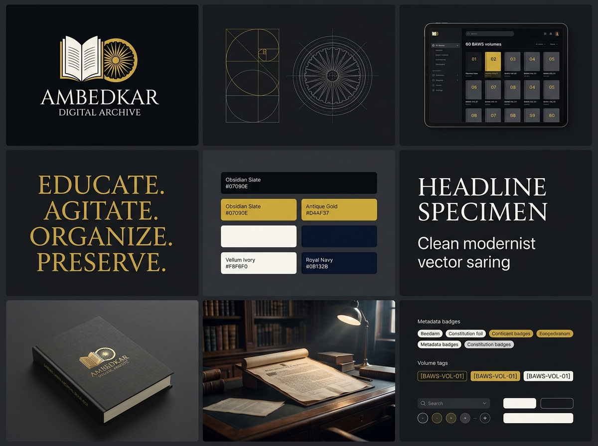

# Dr. B. R. Ambedkar Digital Heritage Archive
## Institutional Brand Guidelines & Visual Design System

**Curated & Engineered by:** Sujal Roxx  
**Classification:** Digital Humanities, Institutional Heritage & Constitutional Research  
**Version:** 1.0.0 (Museum & Production Specification)  
**Permanent Asset:** `ambedkar-archive/docs/brandkit-overview.jpg`

---

## 1. Brand Identity & Strategic Philosophy

### 1.1 Core Mission & Purpose
The **Dr. B. R. Ambedkar Digital Heritage Archive** is an institution-grade, open-access digital repository and research platform dedicated to the preservation, scholarly analysis, and global dissemination of the life's work of Dr. Bhimrao Ramji Ambedkar.

The archive codifies 60 official BAWS volumes (20 English, 40 Hindi), 361 personal and political letters, the 22 historical Dhamma vows, the Constituent Assembly Debates (CAD), and an AI-augmented semantic research assistant with OCR capabilities.

### 1.2 The Brand Metaphor
The identity is anchored in the convergence of two foundational symbols:
1. **The Dhamma Chakra / Sovereign Wheel:** 24 spokes representing continuous ethical progress, constitutional righteousness, equality, and civic liberty.
2. **The Open Archival Folio:** Representing the constitutional codex, lifelong scholarship, and the democratization of knowledge.

> **Institutional Axiom:**  
> *"Educate. Agitate. Organize. Preserve."*

---

## 2. Visual Identity Overview (Brand-Kit Board)



### The 3 × 3 Identity Grid Breakdown:
* **Panel 1 — Primary Seal & Wordmark:** Stately open codex framing the Dhamma wheel, balanced with high-contrast serif typography.
* **Panel 2 — Geometric Construction Blueprint:** Mathematical harmony utilizing circular arcs, golden ratio proportions ($1:1.618$), and 24 radial sectors.
* **Panel 3 — Digital Research Interface:** High-contrast obsidian slate digital catalog showing 60 BAWS volumes on tablet glass.
* **Panel 4 — Brand Essence:** Typographic proclamation of the core motto in antique gold leaf lettering.
* **Panel 5 — Chromatic Foundation:** Scientific color palette with exact Hex, RGB, and HSL tokens.
* **Panel 6 — Typographic Specimen:** Architectural pairing of classical institutional serif mastheads with clean modernist interface sans.
* **Panel 7 — Physical Materiality:** Embossed metallic gold foil on woven black linen archival collector's volume.
* **Panel 8 — Atmospheric Art Direction:** Natural dramatic library chiaroscuro illuminating historical parchment and constitutional manuscripts.
* **Panel 9 — Design System & Micro-Tokens:** Metadata chips (`[BAWS-VOL-01]`, `[CAD-1949]`), search inputs, and Doppelrand containment tokens.

---

## 3. Chromatic Palette & CSS Tokens

The visual palette is calibrated for dark-mode scholarly endurance, reducing ocular fatigue during extended reading of 1,000+ page volumes while preserving ceremonial gravitas.

| Token Name | Hex Code | HSL / RGB | Purpose / Application |
|---|---|---|---|
| `--color-obsidian-deep` | `#07090e` | `hsl(223, 33%, 4%)` | Primary canvas, global background |
| `--color-slate-surface` | `#0a0d14` | `hsl(220, 33%, 6%)` | Card containers, navigation rails, modal backing |
| `--color-slate-elevated`| `#141b2b` | `hsl(220, 36%, 12%)` | Hover states, elevated surfaces, dropdown panels |
| `--color-gold-antique`  | `#d4af37` | `hsl(46, 65%, 52%)` | Primary institutional accent, seals, gold foil rules |
| `--color-gold-vibrant`  | `#c89d28` | `hsl(44, 67%, 47%)` | Interactive highlights, active tabs, buttons |
| `--color-parchment-ivory`| `#f8f6f0` | `hsl(45, 38%, 96%)` | Primary text headings, archival document readers |
| `--color-ink-muted`     | `#94a3b8` | `hsl(215, 20%, 65%)` | Secondary metadata, citations, volume subtitles |
| `--color-navy-regal`    | `#0b132b` | `hsl(225, 59%, 11%)` | Subtle gradient underlays, search bar borders |
| `--color-border-hairline`| `rgba(255, 255, 255, 0.08)` | Semi-transparent | Outer Doppelrand border |
| `--color-specular-glow` | `rgba(255, 255, 255, 0.15)` | Semi-transparent | Inner top specular card bevel |

### Implementation Snippet (`design-tokens.css`):
```css
:root {
  --bg-primary: #07090e;
  --bg-surface: #0a0d14;
  --bg-surface-elevated: #141b2b;
  --accent-gold: #d4af37;
  --accent-gold-hover: #c89d28;
  --text-primary: #f8f6f0;
  --text-secondary: #94a3b8;
  --text-muted: #64748b;
  --border-subtle: rgba(255, 255, 255, 0.08);
  --border-gold: rgba(212, 175, 55, 0.35);
  --font-display: 'Cinzel', 'Playfair Display', Georgia, serif;
  --font-sans: 'Plus Jakarta Sans', -apple-system, BlinkMacSystemFont, 'Inter', sans-serif;
  --font-mono: 'JetBrains Mono', 'SF Mono', Consolas, monospace;
  --card-radius: 14px;
  --shadow-doppelrand: 0 4px 20px rgba(0, 0, 0, 0.45), inset 0 1px 0 rgba(255, 255, 255, 0.12);
}
```

---

## 4. Typography System

The typography creates a respectful dialogue between historic statecraft and modern computational retrieval.

### 4.1 Display & Masthead (Classical Institutional Serif)
* **Primary:** `Cinzel` / `Playfair Display` / `Cormorant Garamond`
* **Weights:** `600 (Semi-Bold)`, `700 (Bold)`
* **Usage:** Site title, hero proclamations, volume titles, commemorative vows, official dates.
* **Character:** Stately, timeless, authoritative, carved in stone.

### 4.2 Interface & Reading Body (Modern High-Legibility Sans)
* **Primary:** `Plus Jakarta Sans` / `Inter` / `-apple-system`
* **Weights:** `400 (Regular)`, `500 (Medium)`, `600 (Semi-Bold)`
* **Usage:** Speeches, catalog entries, correspondence transcripts, form inputs, tooltips.
* **Line Height:** `1.65` for optimal scholarly legibility.

### 4.3 Archival & Computational Data (Monospace)
* **Primary:** `JetBrains Mono` / `SF Mono` / `Consolas`
* **Usage:** Volume identifiers (`[BAWS-VOL.03]`), date codes (`[1949-11-25]`), OCR confidence ratings, API endpoints, cryptographic checksums.

---

## 5. Architectural Component Craft & "Doppelrand" Enclosures

The project adheres to the **Doppelrand (Double-Bezel)** enclosure standard to create tactile depth without tacky skeuomorphism:

```css
/* Museum-Grade Doppelrand Enclosure */
.archive-card {
  background: rgba(10, 13, 20, 0.85);
  backdrop-filter: blur(16px);
  -webkit-backdrop-filter: blur(16px);
  border: 1px solid rgba(255, 255, 255, 0.08);
  border-radius: var(--card-radius);
  box-shadow: 
    0 10px 30px -10px rgba(0, 0, 0, 0.6),
    inset 0 1px 1px rgba(255, 255, 255, 0.12),
    inset 0 -1px 1px rgba(0, 0, 0, 0.4);
  transition: transform 0.25s cubic-bezier(0.16, 1, 0.3, 1), border-color 0.25s ease;
}

.archive-card:hover {
  transform: translateY(-2px);
  border-color: rgba(212, 175, 55, 0.4);
  box-shadow: 
    0 14px 40px -10px rgba(0, 0, 0, 0.8),
    0 0 20px rgba(212, 175, 55, 0.12),
    inset 0 1px 1px rgba(255, 255, 255, 0.2);
}
```

---

## 6. Voice, Tone & Copywriting Guidelines

### 6.1 Tone Pillars
1. **Dignified & Scholarly:** Speak with the rigor of an archivist and the reverence of a constitutional historian.
2. **Accessible & Democratic:** Knowledge belongs to everyone. Avoid overly esoteric jargon; make search results, citations, and summaries immediate and clear.
3. **Objective & Historically Verifiable:** Present primary sources, historical records, and speeches without distortion or editorializing.

### 6.2 Prohibited Patterns
* ❌ Never use generic Silicon Valley jargon (*"Revolutionizing archival workflows"*, *"The ultimate 10x tool"*).
* ❌ Never obscure historical citations; always cite the volume and page number where available.
* ❌ Avoid cartoonish or garish animations; transitions should feel weighted, smooth (0.3s–0.4s), and deliberate.

---

## 7. Institutional Credit & Governance

* **Platform:** Dr. B. R. Ambedkar Digital Heritage Archive
* **Lead Architect & Curator:** **Sujal Roxx**
* **Repository:** [https://github.com/RoxxSujal7/brsih2026](https://github.com/RoxxSujal7/brsih2026)
* **Licensing:** Cultural Heritage Open Access — Dedicated to global research, historical education, and civic empowerment.
